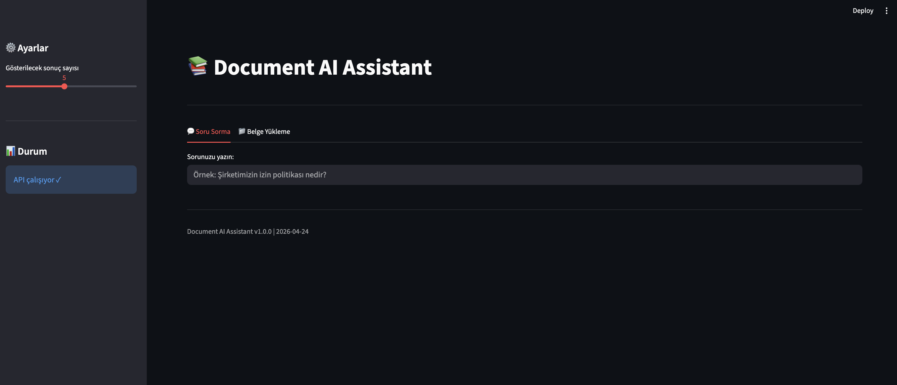

# Document AI Assistant 🤖

Şirket belgelerini işleyen, üzerinde arama yapan ve sorulara kaynak göstererek cevap veren yapay zeka asistanı. RAG (Retrieval-Augmented Generation) sistemi ile kurumsal bilgi yönetimi için güçlü bir altyapı.



## 📋 İçindekiler

- [Özellikler](#-özellikler)
- [Mimari](#-mimari)
- [Kurulum](#-kurulum)
- [Yapılandırma](#-yapılandırma)
- [Çalıştırma](#-çalıştırma)
- [API Kullanımı](#-api-kullanımı)
- [Proje Yapısı](#-proje-yapısı)
- [Teknoloji Stack](#-teknoloji-stack)

## ✨ Özellikler

- **📄 Çoklu Format Desteği** - PDF, DOCX, TXT, MD belgelerinden metin çıkarma
- **🔍 Akıllı Arama** - Semantic similarity tabanlı vektör araması
- **🧠 LLM Entegrasyonu** - OpenAI GPT modelleri ile doğal dil cevapları
- **📚 Kaynak Gösterme** - Her cevabın hangi belgeye dayandığını gösterir
- **🧩 Chunking Stratejisi** - Belgeyi anlamlı parçalara böler
- **💾 Kalıcı Vektör DB** - ChromaDB ile local vektör depolama
- **🎨 Modern UI** - Streamlit ile kullanımı kolay arayüz

## 🏗️ Mimari

```
┌─────────────────────────────────────────────────────────────┐
│                      Document AI Assistant                    │
├─────────────────────────────────────────────────────────────┤
│                                                             │
│  ┌───────────┐    ┌───────────┐    ┌───────────────────┐   │
│  │  Upload   │───▶│   Load    │───▶│   Text Cleaning   │   │
│  │  Document │    │   PDF/    │    │   & Chunking      │   │
│  └───────────┘    │   DOCX    │    └─────────┬─────────┘   │
│                   └───────────┘              │              │
│                                             ▼              │
│  ┌───────────┐    ┌───────────┐    ┌───────────────────┐   │
│  │   User    │───▶│  Query    │───▶│     Retrieval     │   │
│  │   Query   │    │  Process  │    │   (Vector Search) │   │
│  └───────────┘    └───────────┘    └─────────┬─────────┘   │
│                                             │              │
│                                             ▼              │
│  ┌───────────┐    ┌───────────┐    ┌───────────────────┐   │
│  │   Chat    │◀───│   LLM     │◀───│   Context Build   │   │
│  │   UI      │    │  Generate │    │   (RAG Prompt)    │   │
│  └───────────┘    └───────────┘    └───────────────────┘   │
│                                                             │
└─────────────────────────────────────────────────────────────┘
```

**Veri Akışı:**
1. Belgeler yüklenir → Metin çıkarılır → Temizlenir → Parçalara ayrılır
2. Parçalar embedding modeli ile vektörlere dönüştürülür
3. Vektörler ChromaDB'de saklanır
4. Kullanıcı sorusu gelir → Vektör araması yapılır → En ilgili belgeler bulunur
5. LLM, ilgili belgeleri bağlam olarak kullanarak cevap üretir
6. Cevap + kaynaklar kullanıcıya gösterilir

## 📦 Kurulum

### Gereksinimler

- Python 3.10+
- OpenAI API hesabı (LLM için)

### Adımlar

```bash
# 1. Projeyi klonlayın
git clone <repo-url>
cd document-ai-assistant

# 2. Virtual environment oluşturun
python -m venv venv
source venv/bin/activate  # macOS/Linux
# venv\Scripts\activate   # Windows

# 3. Bağımlılıkları yükleyin
pip install -r requirements.txt

# 4. Hugging Face token ayarlayın (opsiyonel, hızlı embedding için)
# Bu adım opsiyoneldir, anonim olarak da çalışır
export HF_TOKEN="your-huggingface-token"
```

## ⚙️ Yapılandırma

```bash
# .env dosyasını oluşturun
cp .env.example .env

# .env dosyasını düzenleyin
nano .env  # veya favori editörünüz
```

`.env` dosyası içeriği:

```env
# OpenAI API - LLM için GEREKLİ
OPENAI_API_KEY=sk-your-openai-api-key

# LLM Ayarları
LLM_PROVIDER=openai
LLM_MODEL=gpt-4
LLM_TEMPERATURE=0.3
LLM_MAX_TOKENS=1000

# Chunking Ayarları
CHUNK_SIZE=500
CHUNK_OVERLAP=50

# Paths
VECTOR_STORE_PATH=./data/chroma_db
```

> ⚠️ **ÖNEMLİ:** `.env` dosyası `API_KEY` içerdiği için **ASLA** GitHub'a yüklenmemelidir!

## 🚀 Çalıştırma

```bash
# Terminal 1 - Backend API
uvicorn src.api.main:app --reload --host 0.0.0.0 --port 8000

# Terminal 2 - Frontend UI
streamlit run src/ui/app.py --server.port 8501
```

### Erişim

- **API:** http://localhost:8000
- **API Docs:** http://localhost:8000/docs
- **Frontend:** http://localhost:8501

## 📡 API Kullanımı

### Belge Yükleme

```bash
curl -X POST "http://localhost:8000/documents/upload" \
  -F "file=@path/to/document.pdf"
```

### Sorgulama

```bash
curl -X POST "http://localhost:8000/documents/query?query=izin+politikasi+nedir"
```

### Sadece Arama

```bash
curl "http://localhost:8000/documents/search?query=izin+politikasi&top_k=5"
```

## 📁 Proje Yapısı

```
document-ai-assistant/
├── README.md              # Bu dosya
├── .env.example           # Ortam değişkenleri şablonu
├── .gitignore             # Git ignorelist
├── requirements.txt       # Python bağımlılıkları
├── BASLATMA.md            # Hızlı başlatma kılavuzu
│
├── data/                  # Veri dizini
│   └── uploads/           # Yüklenen belgeler
│
└── src/
    ├── api/
    │   └── main.py        # FastAPI backend
    │
    ├── ui/
    │   └── app.py         # Streamlit frontend
    │
    ├── utils/
    │   ├── loader.py      # PDF/DOCX/TXT okuyucu
    │   └── processor.py   # Metin temizleme & chunking
    │
    ├── embeddings/
    │   └── vector_store.py # ChromaDB & Sentence Transformers
    │
    ├── retrieval/
    │   └── retriever.py   # Benzerlik araması
    │
    ├── llm/
    │   └── generator.py   # OpenAI entegrasyonu
    │
    └── tests/
        └── test_retrieval.py # Kalite testleri
```

## 🛠️ Teknoloji Stack

| Katman | Teknoloji | Açıklama |
|--------|-----------|----------|
| **Backend** | FastAPI | Modern, hızlı Python API framework |
| **Frontend** | Streamlit | Hızlı data app geliştirme |
| **Belge İşleme** | PyPDF2, python-docx | PDF/Word metin çıkarma |
| **Embedding** | sentence-transformers | Hugging Face modelleri |
| **Vektör DB** | ChromaDB | Local, lightweight vektör veritabanı |
| **LLM** | OpenAI API | GPT-4/GPT-3.5 |

## 📝 Lisans

MIT License

## 🤝 Katkıda Bulunma

1. Fork yapın
2. Feature branch oluşturun (`git checkout -b feature/amazing-feature`)
3. Commit yapın (`git commit -m 'Add amazing feature'`)
4. Push yapın (`git push origin feature/amazing-feature`)
5. Pull Request açın
